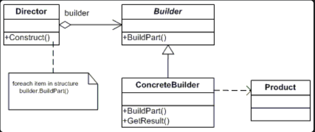

# go_patterns
go patterns designs

## Description
This repo contains simple functional builder patterns design implemented by using go language

## introduction

The Builder Pattern is a creational design pattern that’s used to encapsulate the construction logic for an object. It is often used when the construction process of an object is complex. The patterns is well suited for constructing different representations of the same class.

## Purpose
Separate the construction of a complex object from its representation so that the same construction process can create different representations.
A common software creational design pattern that’s used to encapsulate the construction logic for an object.

## UML

The Builder Pattern is comprised of four components: a builder interface, a concrete builder, a director and a product.



- Builder defines a template for the steps to build the product. Specifies an abstract interface for creating parts of a Product object. It defines no logic, just the blueprint of the process. It is what to do part of the code, not how to do it.
- Concrete Builder implements the builder interface and provides an interface for getting the product. Constructs and assembles parts of the product by implementing the Builder interface defines and keeps track of the representation it creates provides an interface for retrieving the product. ConcreteBuilder builds the product’s internal representation and defines the process by which it’s assembled includes classes that define the constituent parts, including interfaces for assembling the parts into the final result. All the products implement the Build Process to serve their needs.
- Director constructs the object through the builder interface.
- Product is the main object that’s constructed. Represents the complex object under construction.

## Example

main structures

- Person
- PersonBuilder: has a reference pointer to Person
- NewPersonBuilder: return a pointer to PersonBuilder
- Build: a PersonBuilder function that return the final person instance.
- Parameters: Setting via PersonBuilder functions that returns a pointer to PersonBuilder  


## Final Example

```go
func main() {
	p := fmt.Println
	p(PatternName)

	pb := NewPersonBuilder()
	pb.Lives().
		At("Bangalore").
		WithPostalCode("560102").
		Works().
		As("Software Engineer").
		For("IBM").
		In("Bangalore").
		WithSalary(150000)
	person := pb.Build()

	p(person)

}
```